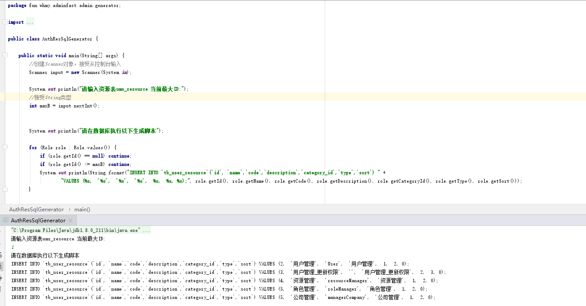
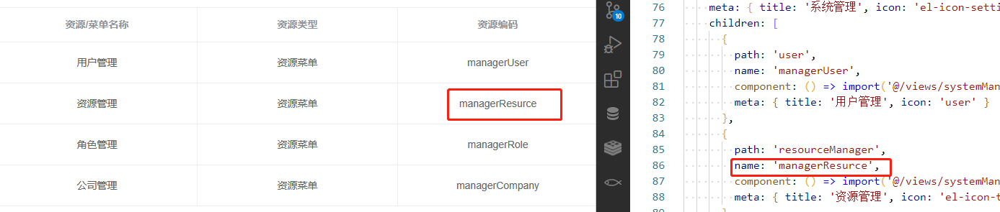
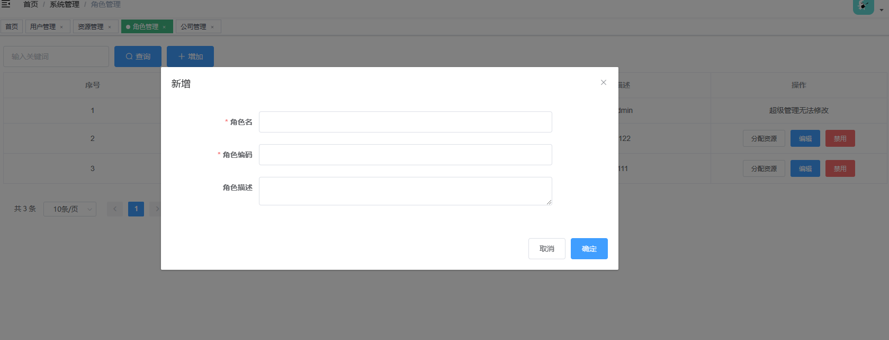
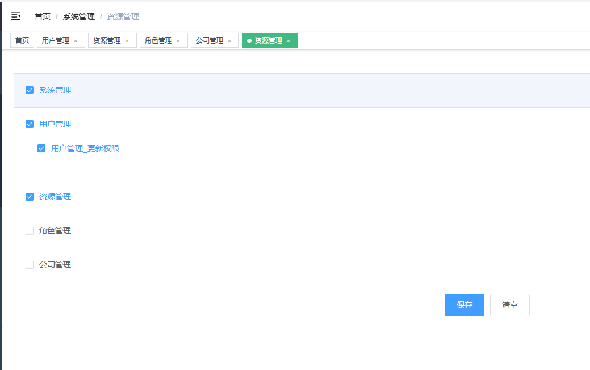
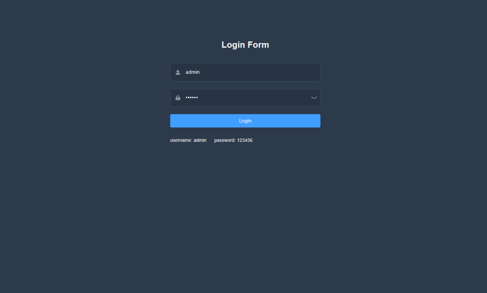
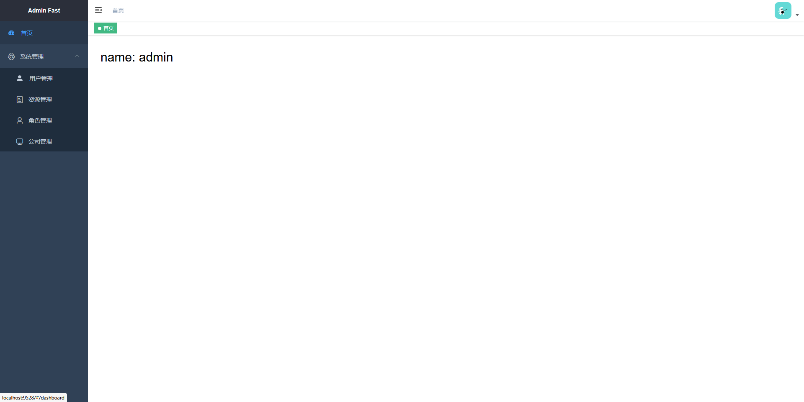
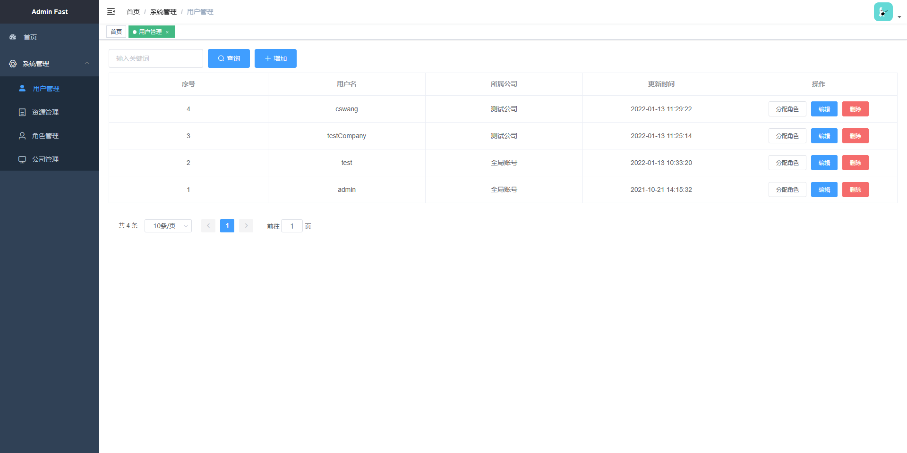
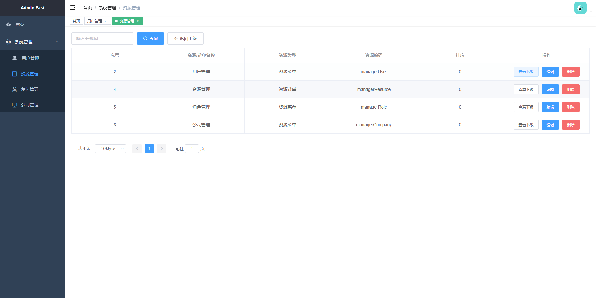
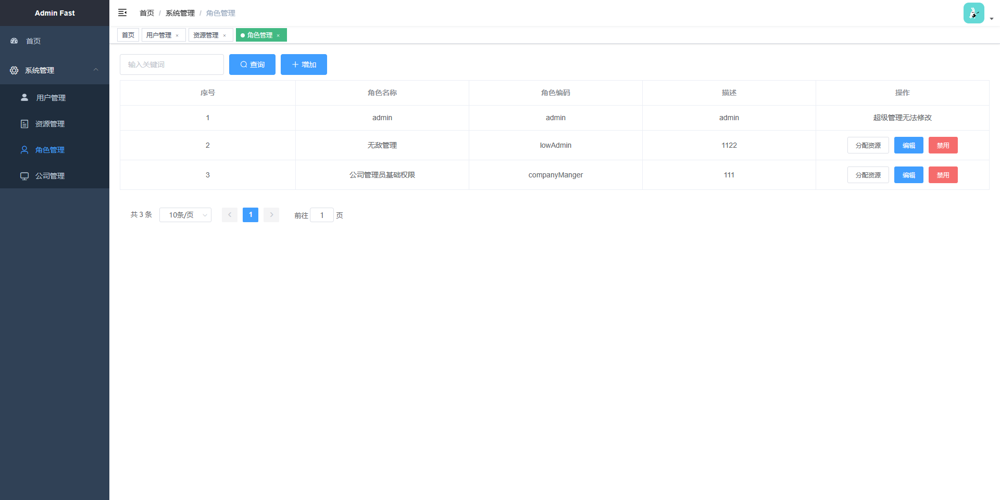
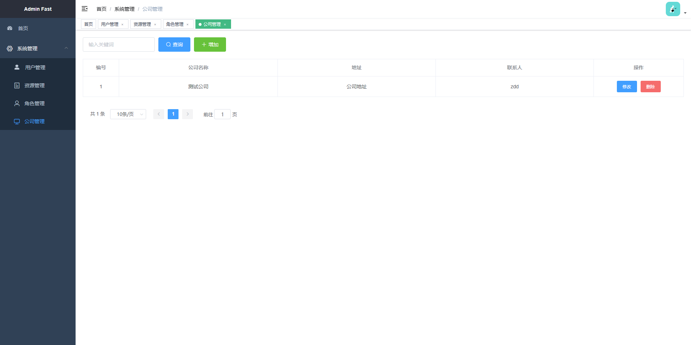

# admin-fast

> 一套简单开箱即用的最基础的后台管理系统脚手架

## 平台简介

看了些后台管理系统的开源项目，发现没有特别合适自己开发使用的脚手架。

刚好最近又有项目需要，于是利用两天的时间自己搭建了一套后台系统，打算公布出来看看有没有人会用得到。

项目中仅包含基础的登录登出，用户管理，公司（部门）管理，资源管理，角色管理，前端菜单控制这些基础内容，其他功能需你们自己往里面添加了。


* 感谢 [vue-element-admin](https://github.com/PanJiaChen/vue-element-admin) 后台主题 UI 框架。
* 接口访问地址：[http://localhost:16810](http://localhost:16810/doc.html)
* 前端访问地址：[http://localhost:9528](http://localhost:9528)
    * 用户名：admin；密码：123456


#### 功能模块：

- 登录登出
  - 密码RSA加密
  - 登录密码加密传输
- 用户管理
  - 支持单个用户分配多名角色
  - 用户分全局账号或公司所属账号
- 资源管理
  - 需后台代码中手动写入
  - 资源与前端菜单联动
  - 可按资源权限控制页面内元素信息
  - 支持前端菜单排序
  - 支持动态修改菜单名称
  - 理论上不应该让公司所属账号拥有资源管理权限，代码未作限制
- 角色管理
  - 角色按照公司划分
  - 用户仅支持添加编辑本公司的角色
- 公司管理
  - 公司仅支持一级管理
  - 理论上不应该让公司所属账号拥有公司管理权限，代码未作限制


#### 技术介绍

| 技术                   | 版本    | 作用                                                   |
| ---------------------- | ------- | ------------------------------------------------------ |
| java                   | 1.8     | java版本                                               |
| spring boot            | 2.5.4   | 版本依赖，快速开发                                     |
| mybatis-plus           | 3.4.3.4 | 数据库持久层操作工具                                   |
| mybatis-plus-generator | 3.4.1   | 代码生成器（controller、service、mapper、xml、entity） |
| sa-token               | 1.28.0  | java鉴权框架                                           |
| hutool                 | 5.7.16  | java工具类                                             |
| druid                  | 1.1.21  | 数据库连接池                                           |


#### 后端如何运行

1. 创建application-dev.yml 将 application-prod.yml 中的内容填入
2. 准备redis和mysql
3. mysql中导入adminfast.sql
4. 修改application-dev.yml 中的数据库和redis地址
5. 直接运行 WebApplication 即可

#### 前端如何运行

1. 命令行进入/fronend/admin
2. 执行 npm install
3. 修改 vue.config.js中的proxy为自己的后端地址
4. 执行 npm run dev
5. 访问地址：[http://localhost:9528](http://localhost:9528)
   
   * 用户名：admin；密码：123456
   
   

#### 资源菜单联动如何使用

> admin角色系统默认会拥有所有资源菜单权限，逻辑可自己修改

新增的资源需手动加入数据库，可通过AuthResSqlGenerator产生sql语句



新增的资源中code属性需要和前端路由中的name属性对应



新增角色



为角色分配资源




#### 接口资源权限如何使用
> admin角色系统默认会拥有所有资源权限，逻辑可自己修改

在相应接口上添加 @SaCheckPermission(”resourceCode“),系统默认只拦截/rest下的接口信息，可在WxMvcConfig#addInterceptors中进行修改拦截的路径信息

资源信息可添加至AdminRole可方便使用

```java
    @SaCheckPermission(AdminRole.SYSTEM_MANAGER_COMPANY)
    @PostMapping("/update")
    public ResultBean update(@RequestBody TbUserCompanyBean userCompanyBean){
        dosomething...
    }
```


#### 基础功能演示图

登录页面

dashboard页面

用户管理

资源管理

角色管理

资源分配

公司管理

#### 打个小广告
> 自己开发的打牌计分小程，微信搜索:毛线家的计分器，大家可以扫码支持一波


#### 联系作者

